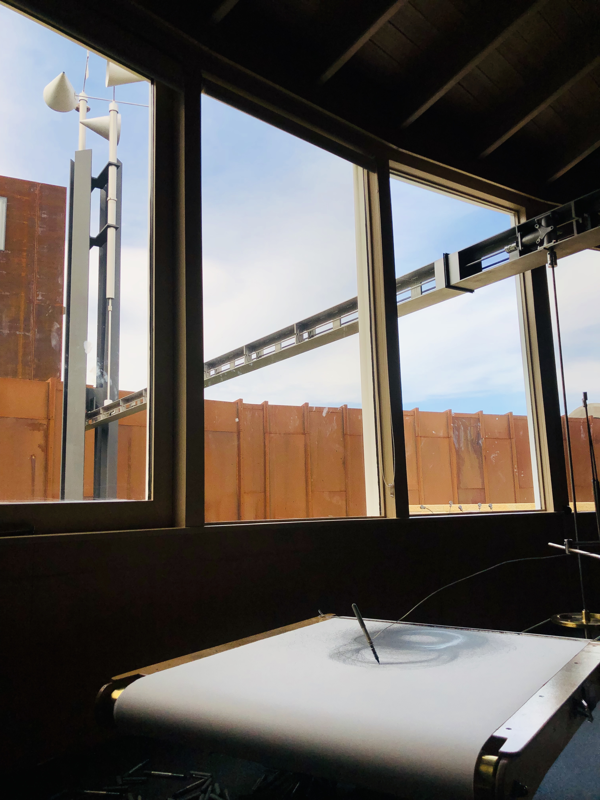

Robbins is an Australian artist who harnesses the randomness of natural forces. He builds instruments that transcribe changes in the wind or tide into drawings. These instruments can be left running day and night –
always creating, always recording.

The part I found most interesting was that concept of perpetual creation. I also liked that the output was permanent. A lasting record of something as fleeting as a gust of wind. I think my brother would also really appreciate the mechanics of it all.

### Wind section instrumental

