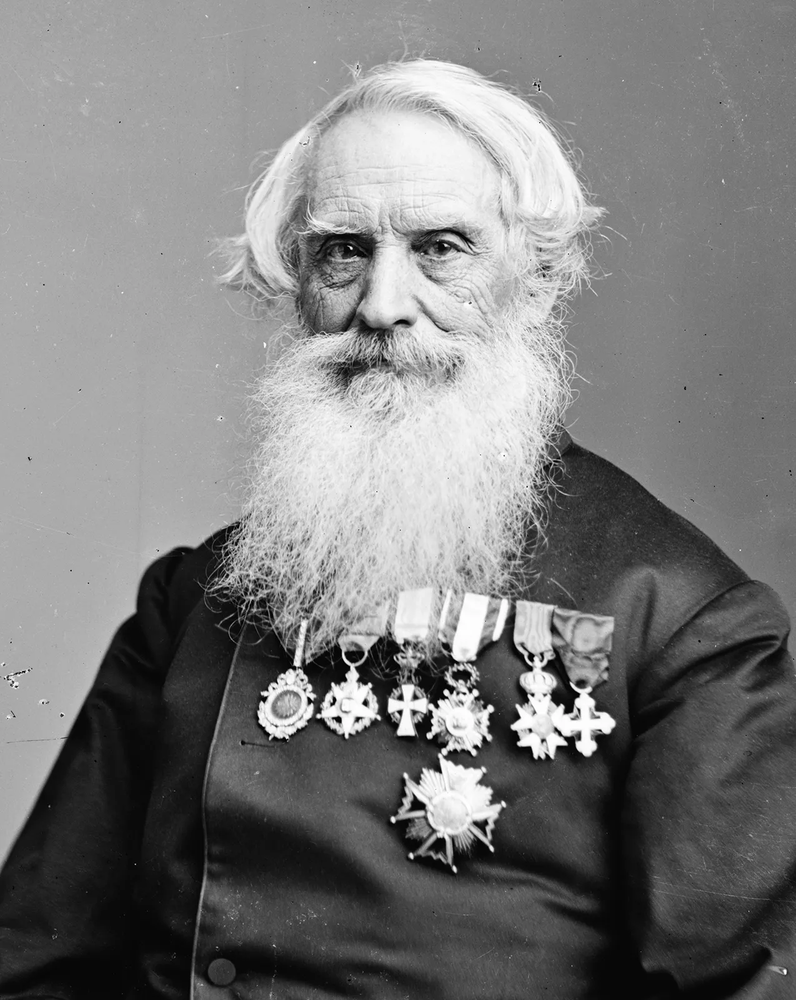

The moving story of Samuel Breese Morse and the first telegram. A three minute podcast about love, loss, art and invention. A great reminder of the power of narrative too.

I'm not crying, you're crying!

[Listen here](https://beta.prx.org/stories/254022)

