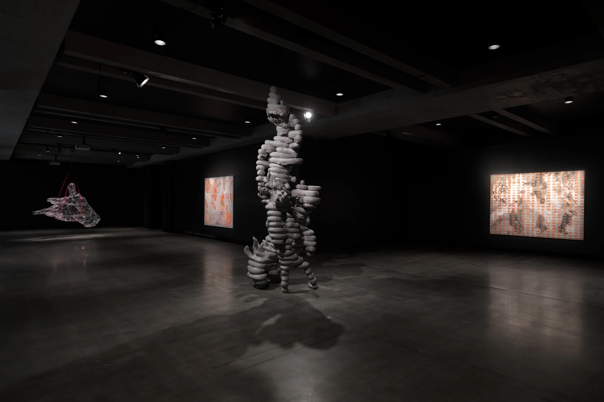

### Your Shadow Rising

Your shadow rising was the highlight of MONA for me. Located at the bottom of the vast gallery, the exhibit includes a number of paintings sculptures videos.

MONA uses an app called "The O". It replaces wall texts in the museum and allows visitors to read or listen to stories, essays, music and interviews about the different art.

Being able to here interviews with Toby and learn more about his process made the art much more meaningful for me.

### The O App

[Download from the iOS app store](https://itunes.apple.com/au/app/the-o/id1161982400?mt=8)

