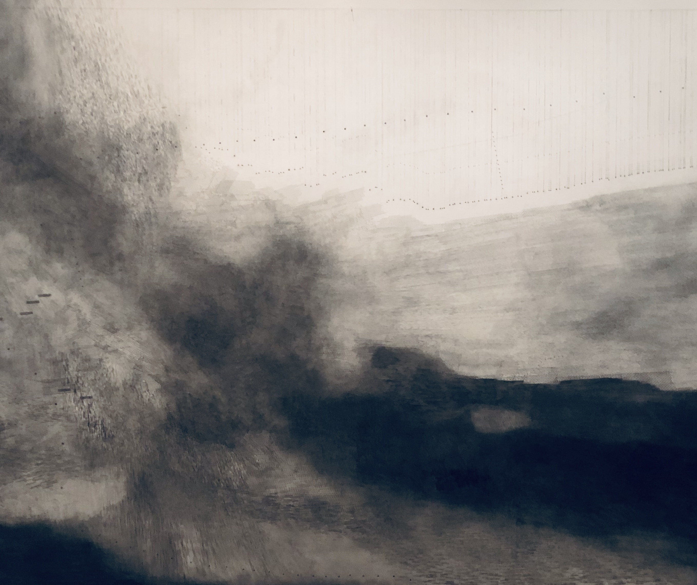

### Emma McNally

I saw Emma's work at MONA during a recent trip to Tasmania. I liked how moody and stark the drawings felt especially in the subterranean part of the gallery. Emma is from Essex too.

1–12, 2014–16 graphite on paper, 214 x 304 cm each.

