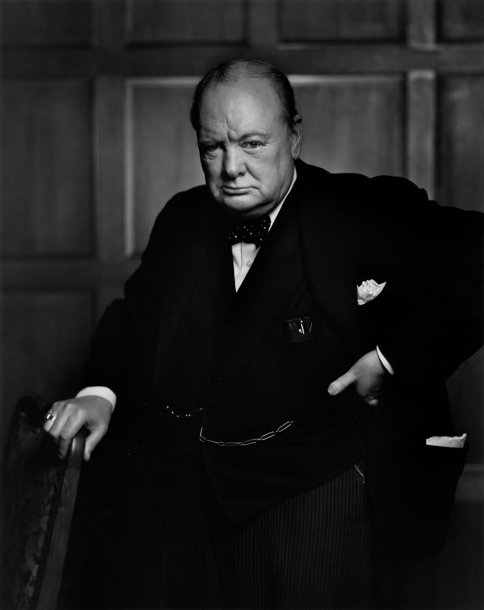

Today I learned about Yousuf Karsh.

### Churchill by Karsh

“My portrait of Winston Churchill changed my life. I knew after I had taken it that it was an important picture, but I could hardly have dreamed that it would become one of the most widely reproduced images in the history of photography.

In 1941, Churchill visited first Washington and then Ottawa. The Prime Minister, Mackenzie King, invited me to be present. After the electrifying speech, I waited in the Speaker’s Chamber where, the evening before, I had set up my lights and camera. The Prime Minister, arm-in-arm with Churchill and followed by his entourage, started to lead him into the room.

I switched on my floodlights; a surprised Churchill growled, ‘What’s this, what’s this?’ No one had the courage to explain. I timorously stepped forward and said, ‘Sir, I hope I will be fortunate enough to make a portrait worthy of this historic occasion.’ He glanced at me and demanded, ‘Why was I not told?’ When his entourage began to laugh, this hardly helped matters for me. Churchill lit a fresh cigar, puffed at it with a mischievous air, and then magnanimously relented. ‘You may take one.’

Churchill’s cigar was ever present. I held out an ashtray, but he would not dispose of it. I went back to my camera and made sure that everything was all right technically. I waited; he continued to chomp vigorously at his cigar. I waited. Then I stepped toward him and, without premeditation, but ever so respectfully, I said, ‘Forgive me, sir,’ and plucked the cigar out of his mouth. By the time I got back to my camera, he looked so belligerent he could have devoured me. It was at that instant that I took the photograph.”

