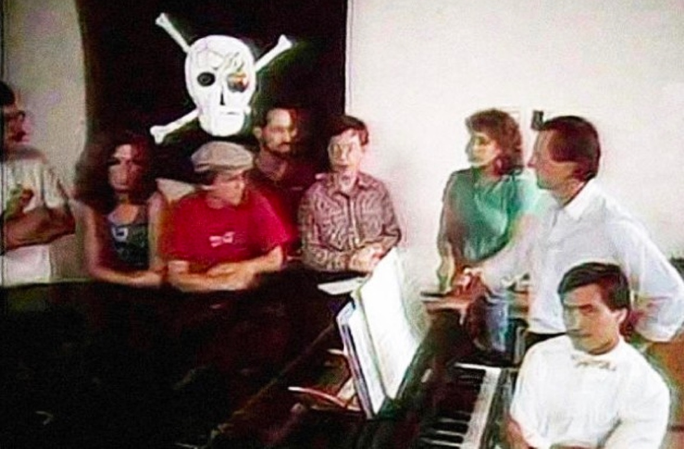
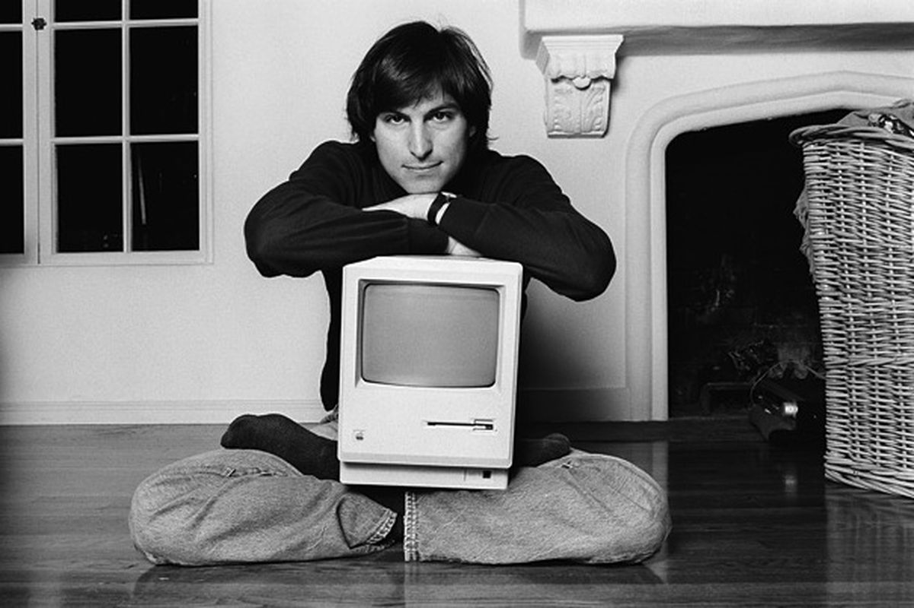

## Making history

On the 22 January 1984, 35 years ago today, the Raiders beat the Redsocks in historic fashion. Marcus Allen and co won 38-9 and claimed the record for the most points scored by an AFC team in Super Bowl history. It was also the day that Apple introduced the Macintosh to the world.

During the third quarter timeout, 77.62 million Americans watched what AdAge would later call the “the most influential commercial ever made”. The sixty second ad was a call to arms, an ideological statement that lorem Apple as the defender of creativity and individualism in the information age.

This brave vision for the future of computing had been years in the making. It was the culmination of lorem, lorem and lorem, much of which can be the early days of the Macintosh project.

## Chairman Jobs

A year earlier, Steve opened the team retreat with three “Sayings from Chairman Jobs”:

1. Real artists ship.
2. It's better to be a pirate than join the navy.
3. Mac in a book by 1986.

The presentation was intended to inspire the Macintosh team to deliver one of the most ambitious and technologically challenging feats in Apple's history. It worked.

Each of the points relates to a fundamental part of building great teams and great products that are just relevant today as they were then.

### Real artists ship.

Get your product out there. It doesn’t matter how extraordinary the idea, how perfect the design or how elegant the code, unless you can get it into users hands what’s the point?

Especially when designing digital products. Ship early and ship often. Real life feedback is so much more valuable than any number of lab testing sessions.

### It’s better to be a pirate than join the navy

Teams have personality. They are the product of the human qualities that are represented in their make up. As such

### Mac in a book by 1986

Have a goal. Make it measurable and achievable but make it ambitious too.
