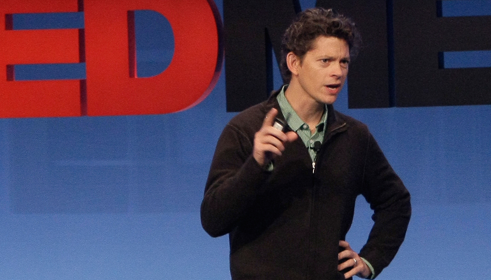

I recently applied for a design role in the health industry. The application process reminded me of my final year university project and a pivotal [Ted Talk](https://www.ted.com/talks/thomas_goetz_it_s_time_to_redesign_medical_data?language=en) I watched.

Thomas Goetz was championing the cause of better design for medical data. His central premises was that if patients where empowered to have responsibility over their own health data (and health in general) there would be considerably better outcomes. Its well worth a watch.

### My final year show

