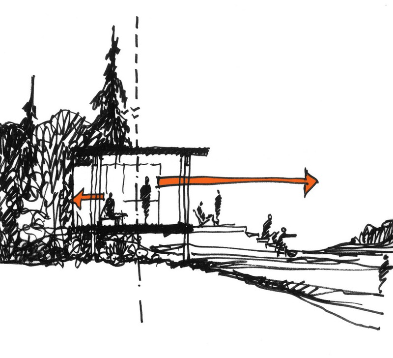

To see without being seen.” Konrad Lorenz, ethologist

Prospect-refuge theory suggests that spaces we find most acceptable to be in present us with great opportunity, yet we must be in a place of safety at the time.

