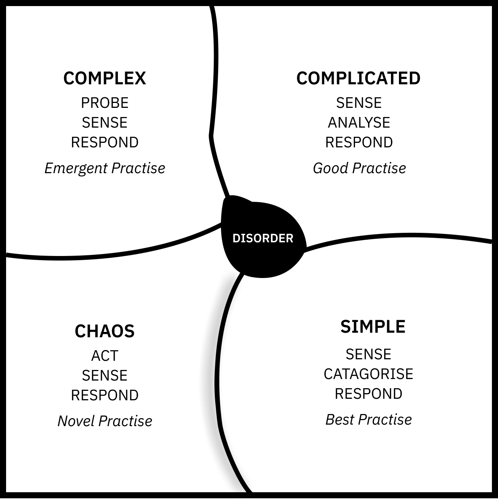

The Cynefin Framework is a conceptual decision making aide by Dave Snowde. It was designed to help people identify and respond to different situations.

### There are 4 states:

- Simple
- Complicated
- Complex
- Chaotic

Each domain has its own characteristics. Simple environments can have logical, predictable solutions. Complicated situations rely on experts that have experience and a deep understanding of a subject matter. Complex situations require a degree of upfront exploration. It’s important to experiment, but with an agreed set of corresponding actions in advance. For example, if we apply pressure to n, and x increases, we do y. If x decreases we do z. Finally with chaotic environments, there is no time for a probing stage because by the time the results are in, the situation has changed and the finding irrelevant. The recommended course of action is to act first, get feedback, and respond accordingly.

One of the hardest parts of applying the Cynefin framework is understanding which environment you are in. Particular caution must be paid to the “Cliff” between Simple and Chaotic. If you act as if you are in a simple environment, but slip in to a chaotic one, it is very hard to recover.

