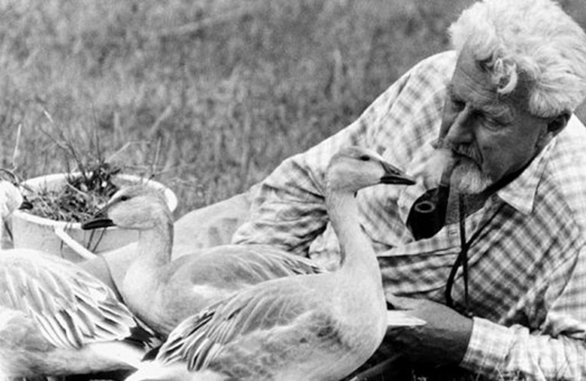

### Konrad Lorenz – On Aggression

...There is a third form of fighting behaviour, and its survival value is easily demonstrated as that of the predator’s attack on its prey or the mobbing by the prey of the eating enemy. With H. Hediger, we call this third behaviour pattern the _critical reaction_.

The expression "fight like a cornered rat" has become symbolic of the desperate struggle in which the fighter stakes his all, because he cannot escape and can expect no mercy. This most violent form of fighting behaviour is motivated by fear, the most intense flight impulses whose natural outlet is prevented by the fact that the danger is too near; so the animal, not daring to turn its back on it, fights with the proverbial courage of desperation. Such a contingency may also occur the, as with the cornered rat, flight is prevented by the lack of space, or by strong social ties, like those of which forbid an animal to desert its brood of family. The attack which a hen or goose makes on every thing that goes too near her chicks or gooslings can also be classified as critical reaction.

Many animals will attack desperately when surprised by an enemy at less than a certain critical distance, whereas they would have fled if they had noticed his coming from further away. As Hediger has described, lion tamers manoeuvre their great beast of prey into their positions in the arena by playing a dangerous game with the margin between flight distance and critical distance; and thousands of big game hunting stories testify to the dangerousness of large beasts of prey in dense cover. The reason is that in such circumstances the flight distance is particularly small, because the animal feels safe, imagining that it will not be noticed by a man even if he should penetrate the cover and get quite close; but if in so doing the man oversteps the animal’s critical distance, a so-called hunting accident happens quickly and disastrously.

