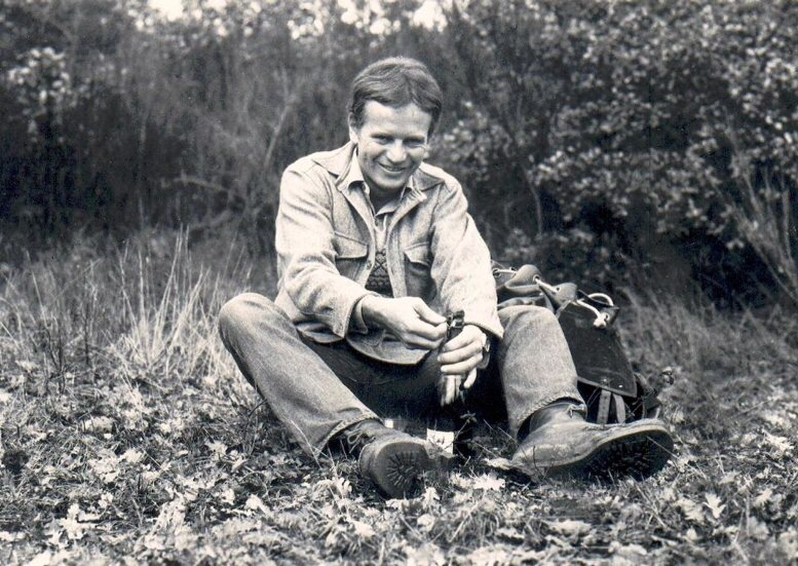

Bruce Chatwin, discussing the virtues of walking. What am I doing here. Page 139.

I saw Werner once or twice after that. And he would phone me from fishing trips in Northumberland, where his brother-in-law was an Anglican parson. He was, I discovered, a compendium of contradictions: immensely tough yet vulnerable, affectionate and remote, austere and sensual, not particularly well-adjusted to the strains of everyday life but functioning efficiently under the extreme conditions.

He was also the only person with whom I could have a one-to-one conversation on what I would call the sacramental aspect of walking. He and I shared a belief that walking is not simply therapeutic for oneself but is a poetic activity that can cure the world of its ills. He sums up his position in a stern pronouncement: ‘Walking is virtue, tourism deadly sin’.

