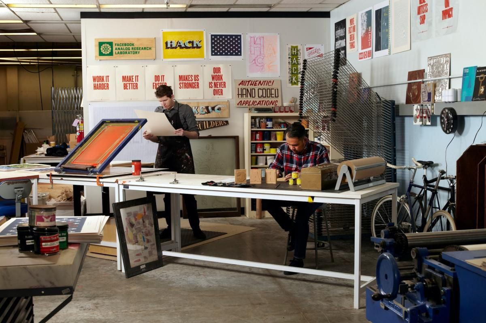
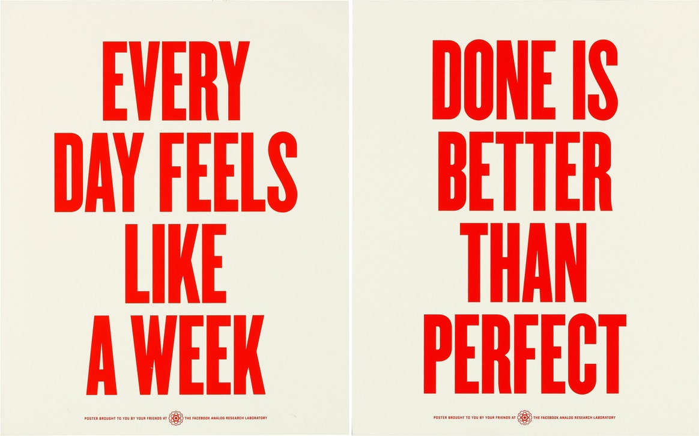
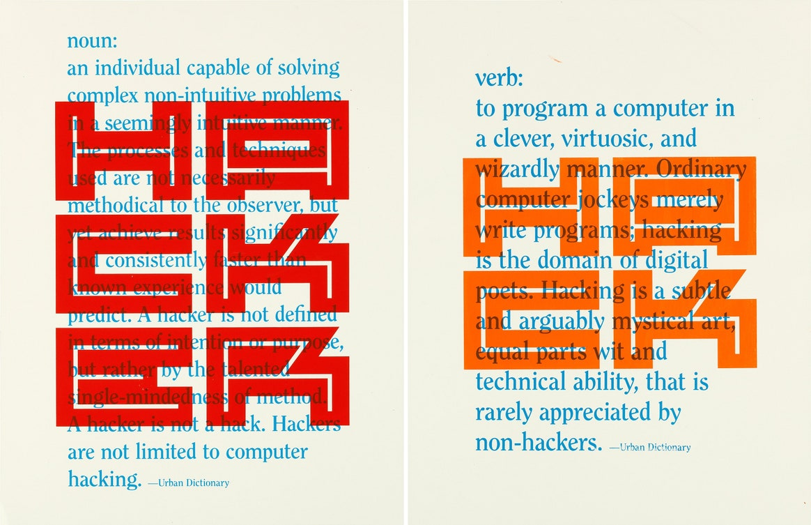
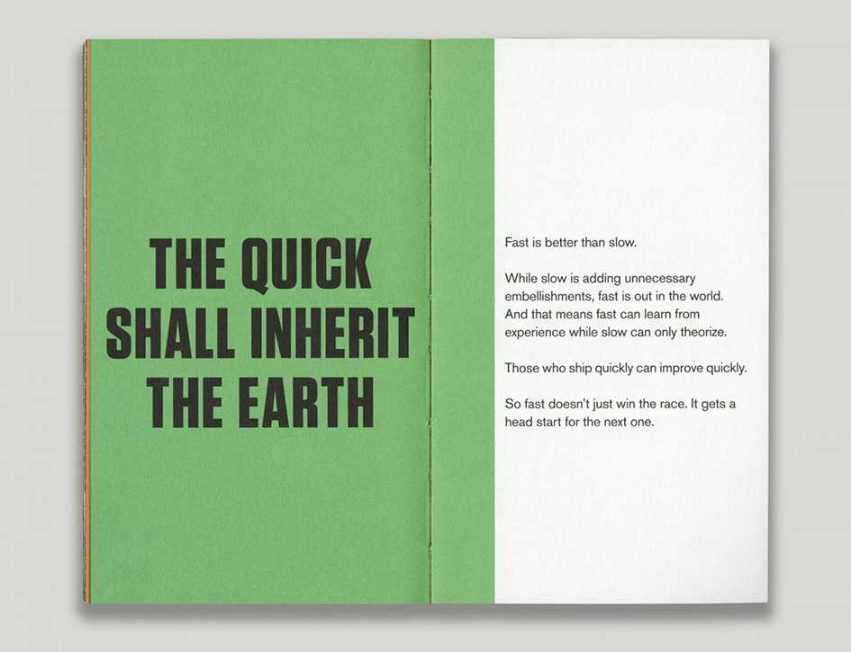

To help soften the blow of the Cov-19 lockdown, filmmaker Gary Hustwit has been streaming a documentary each week for free. Yesterday I watched Urbanized.

“Urbanized (2011, 85 minutes) is a documentary about the design of cities which looks at the issues and strategies behind urban design and features some of the world’s foremost architects, planners, policymakers, builders, and thinkers. Over half the world’s population now lives in an urban area, and 75% will call a city home by 2050”.

Lorem Ipsum

Lorem Ipsum

Lorem Ipsum

Lorem Ipsum

Lorem Ipsum
