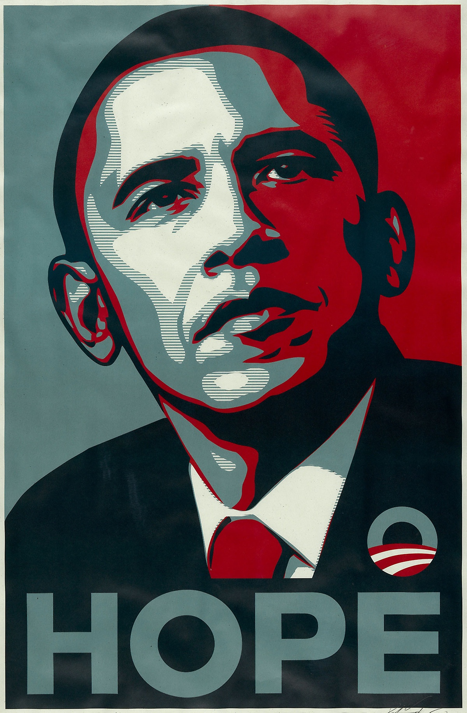

Over the weekend I listened to the [Wilson App](https://play.wilson.fm/playlist/1dHimYJvZuKYaI0qMgwkgs) podcast series on the Obama presidency. Unsurprisingly there was a lot of discussion about Obama's communication style and what made him such a successful orator. Below are my highlights.

### Make it compelling

This is key to a number of his points. “For a message to resonate and be compelling, it has to be simple.” Often politicians get caught up in complexity. That’s fine when the audience is other law makers, but if you want the public to sit up and notice, to take action, the message needs to be simple.

### Write thematically

Obama spoke of how he wanted his memoir to tell a story and be more than a chronological account of his presidency. To do so, he needed to move past individual events and focus on the themes and issues that connected them. This was also true of many of his speeches.

### Focus on the issues

This was a distinction I hadn’t made before. The main distinction being scale. Problems are fairly niche, only concerning a limited number of people. Issues are much broader points and often represent an underlining trend.

Example:  
**Problem** = Leaking roof at apartment block 80  
**Issue** = Poor condition of social housing in Downtown Chicago

### Create a shared vision

Ultimately though, as Obama points out, what moves people is not issues but values. Obama famously used strong narratives in his speeches.

#### Highlighting the past – the beginning

“Tonight more than 200 years after a former colony won the right to determine its own destiny, the task of perfecting our union moves forward...”

#### Describing how things stand – the middle

"...We need to go forward, but progress isn’t always a straight line or a smooth path..."

#### And where he wanted to get to – the end

"...We want our children to live in an America that isn't burdened by debt, that isn't weakened up by inequality, that isn't threatened by the destructive power of a warming planet."

This last part is super important. Without a shared vision of the future, its is so much harder to ask people to make the difficult choices now. People need a North Star. A positive vision of the future.

