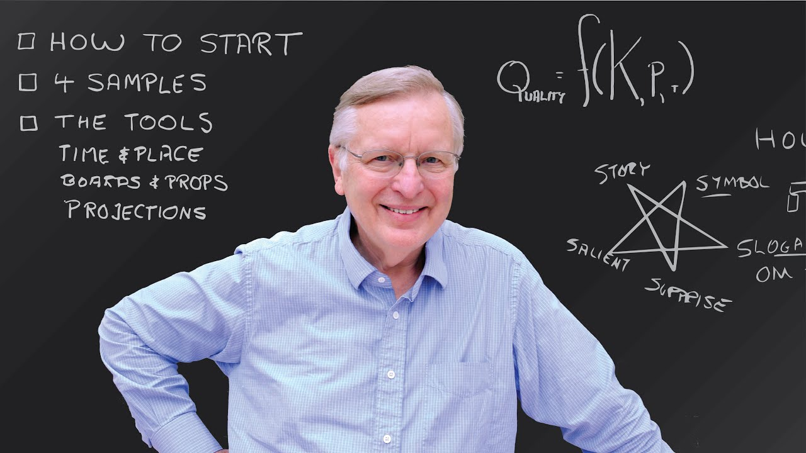

Patrick Winston's 'How to speak' lecture has been on my watchlist for a while. I wanted to make an effort at the start of the year to do so. I'm glad I did. You can watch it [here](https://youtu.be/Unzc731iCUY).

### Notes

- Start with an 'empowerment promise'
- Cycle on the subject - tell them what you want to tell them etc
- Build a fence around your idea - explain why your idea is different
- Verbal punctuation - have set points where you help people “get back on the bus” e.g. repetition, numbered points
- Ask a question, wait 7 seconds. Can’t be too easy or too hard
- Time and place - well lit, 11am, “case it” Like a bank (See the venue before you speak) and pick an appropriate sized room for the number of people
- People like props and 'chalk'. Has to do with empathetic mirroring. You can feel yourself writing on the board when you see someone else do it
- Keep slides simple
- Hapax legomenon (Something you can show only once. e.g. a complex slide)
- Exhibit passion to inspire
- Link passion with the promise at the start
- Story telling. We are symbolic creatures
- Practise
- Show that you have vision (Problem and approach) and that you have done something (steps taken) in the first 5 mins.
- Whys do you want to be famous? Because you want your ideas/work to be recognised.
- Winstons star:
  - Symobol
  - Slogan
  - Surprise
  - Salient idea
  - Story

How to end? Never with a slide that says questions or thank you. Try a 'contributions' slide. Try to avoid saying thank you. It’s weak. Salute the audience instead.

