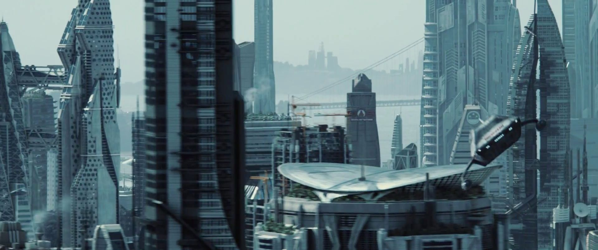

Marc Andreessen's ['It's time to build'](https://youtu.be/Unzc731iCUY) was one of my favourite blogs of 2020. It is a call to arms that perfectly articulates the frustration that I felt at the start of the Covid outbreak. We should have been able ot deal with it better. Many of the issues we faced were solved problems. For me, Marc brought into focus areas of our lives that are in need of investment and modernisation.

As William Gibson said, "the future is already here – it's just not evenly distributed."

