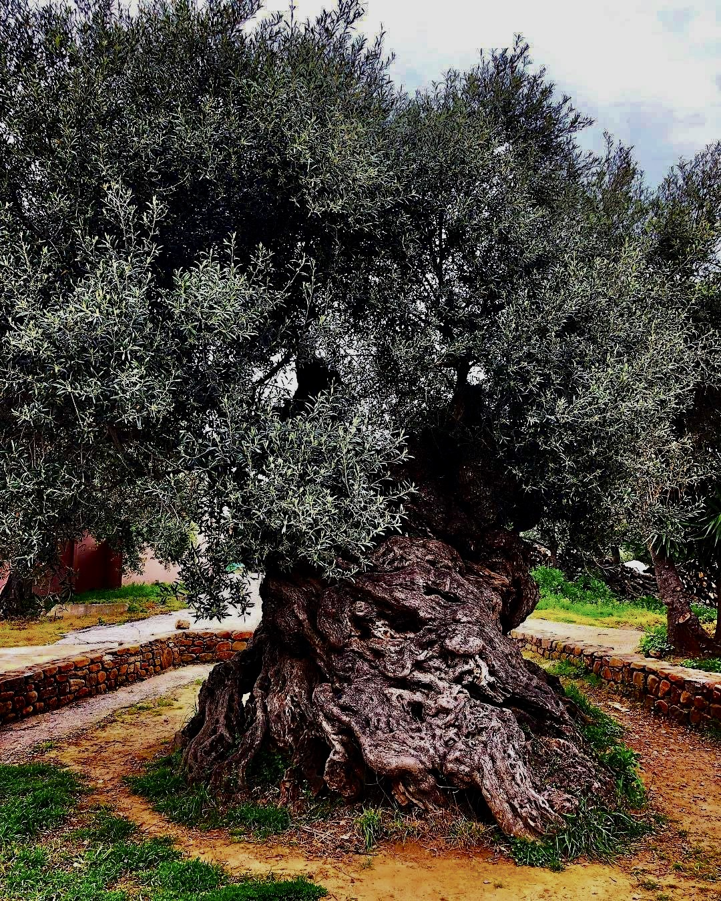

"This ancient olive tree in Crete is an incredible 3,000 years old. It is possible that Minoan hands once gathered olive from the tree at Ano Vouves near Chania, Crete, Greece."

[Original Tweet](https://twitter.com/tzoumio/status/1351455624845008898)

