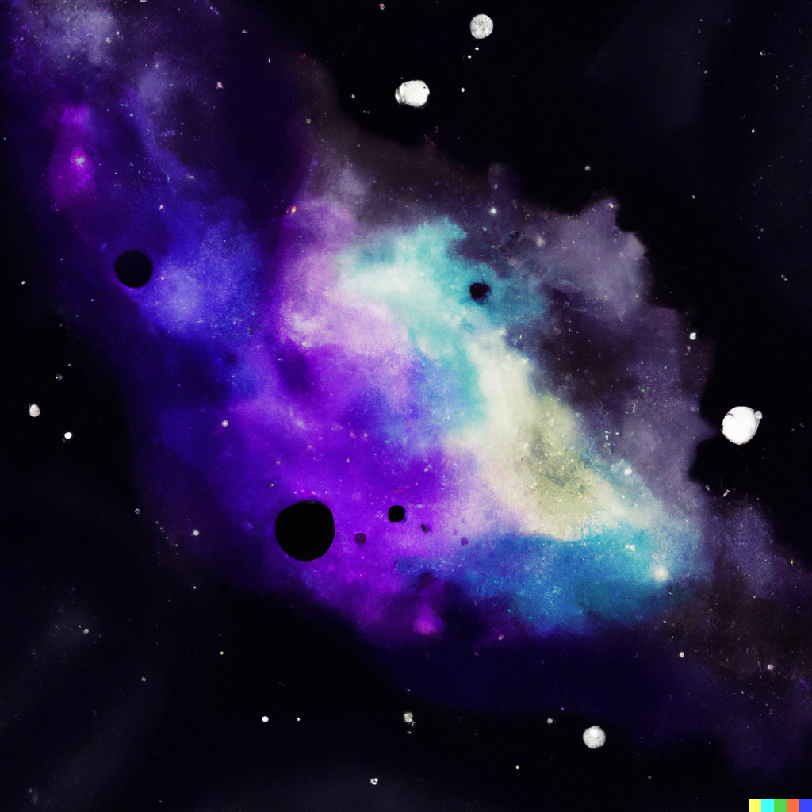

I remember hearing about OpenAI back in 2015, a year after Elon Musk famously [raised concerns](https://twitter.com/elonmusk/status/496012177103663104?ref_src=twsrc%5Etfw%7Ctwcamp%5Etweetembed%7Ctwterm%5E496012177103663104%7Ctwgr%5Eb3ab514623f1cde527f8c15693c9aa16cf972a3e%7Ctwcon%5Es1_&ref_url=https%3A%2F%2Fwww.redditmedia.com%2Fmediaembed%2F2ckxke%3Fresponsive%3Dtrueis_nightmode%3Dfalse) about humanity long-term future. At the time it seemed like an idealistic, if not terrible important venture to help safeguard us from the tyranny of Skynet.

Skip forward to 2023, and it is hard to believe what the team has achieved. I feel inspired by their ingenuity and focus on ship near-magical products. I hope to spend more time this year experimenting with generative AI and learning about it’s potential and limitations.

In the meantime, i’ll share my first result from a DALL·E 2 prompt – 'Water colour of the Big Bang, seconds after the beginning of the universe':

