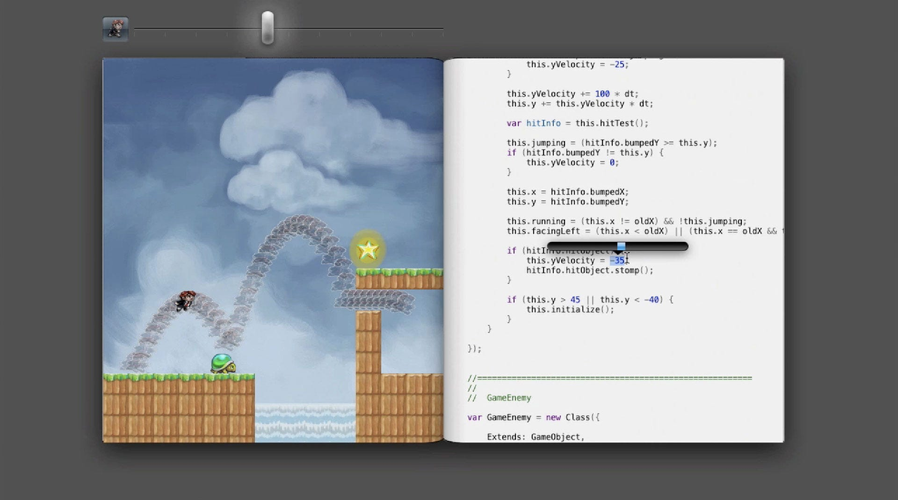

Bret Victor's talk on "Inventing on Principle" explores the idea that creators should be guided by a clear set of principles and values when developing new technologies or projects. Victor advocates for the importance of having a personal set of principles and beliefs that guide the creative process. These principles act as a moral and ethical compass, helping creators make decisions that align with their values.

Bret's guiding principal is that 'creators need an immediate connection to what they are creating'. Some of his key tenets are:

### Immediate Feedback

Tools and systems should provide real-time feedback to creators, allowing them to see the consequences of their actions and make adjustments accordingly.

### Visual Thinking

Visual representations and interactive interfaces can facilitate creative thinking and problem-solving by helping creators better understand complex systems and relationships.

### Interactive Exploration:

Interactive and exploratory tools allow creators to experiment and gain a deeper understanding of their work, where creators constantly refine and improve their work based on ongoing feedback and insights.

[Watch the presentation](https://youtu.be/PUv66718DII?si=oRYcdKJ09iQWxS36)
