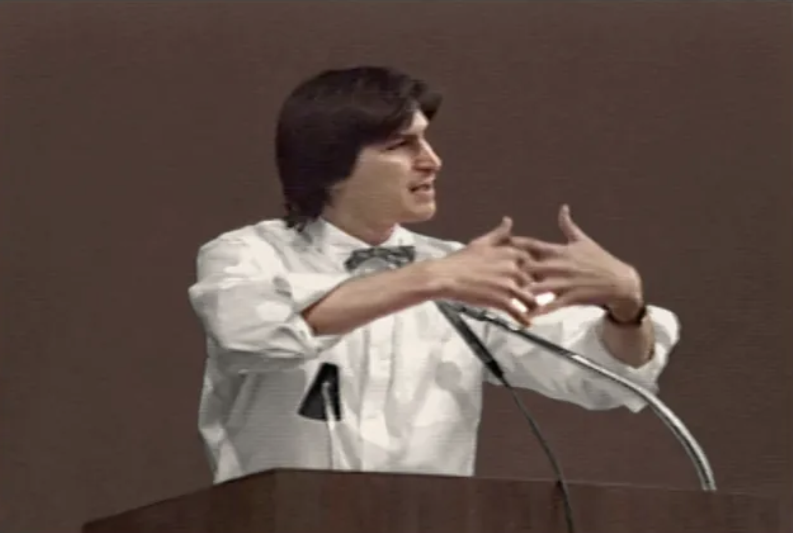

Steve Jobs shares a glimpse of the future... in 1983.

### A Mac in a book

"Apple’s strategy is really simple. What we want to do is put an incredibly great computer into a book that you can carry around with you and learn how to use in 20 minutes. We want to achieve this within the decade, and ideally, we want to include a radio link so you don’t have to connect to anything. You’d be in communication with larger databases and other computers.

We don’t know how to do that yet—it’s technically impossible right now. So, we had three options. The first option was to do nothing, but we’re all pretty young and impatient, so that wasn’t a good choice. The second option was to put a low-quality computer in a book, which we could do, but our competitors are already doing that, and we don’t need to follow them.

The third option was to design the computer we eventually want to put into a book, even though we can’t do it yet. Right now, it fits in a breadbox and costs $10,000. It’s called Lisa. Fortunately, there is a large office market buying these computers faster than we can make them. We’re sold out for the next year and expect to sell over $100 million worth in the first year.

There’s a strong demand in the office marketplace where increasing personal productivity is worth $10,000 per person, and they’re snapping up these machines. They’ll help fund the development of this new technology.

The next step is to shrink it to fit in a shoebox and sell it for around $2,500. After that, we’ll find a way to get it into a book and sell it for under $1,000. We believe we’ll achieve that within five to seven years, and that’s what we’re singularly focused on."

[Read the full blog here](https://stevejobsarchive.com/exhibits/objects-of-our-life/)

