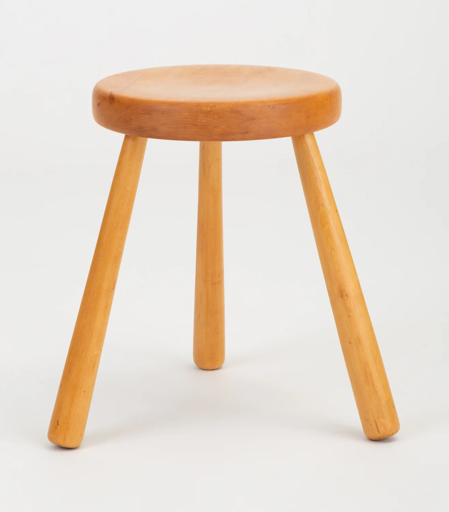

I found myself referencing Alex Schleifer's blog on defining Product Design for 1,000th time this week. It's as true today as it was then. Posting for prosperity.

### Fuse Engineering, Product and Design from the start.

"At some tech companies — Airbnb included — the engineering, product and design teams are hitched and commonly referred to as EPD. By design, each function is involved and aligned from a product’s inception to its launch. For example, a working group for a new feature, product marketing or user feedback will involve at least one member from each of the three teams. This coalition not only assembles the key builders of the product, but, as a byproduct, it also formalizes the professional pathways that a person who wants to create a product can consider.
The team should resemble a three-legged stool, in which each leg represents one of the three areas that helps build a product. If it’s done from the start (Figure A), each function can grow in parallel and proper ratio (Figure B) as the broader organization scales."

[Read the full blog here](https://review.firstround.com/defining-product-design-a-dispatch-from-airbnbs-design-chief/)

