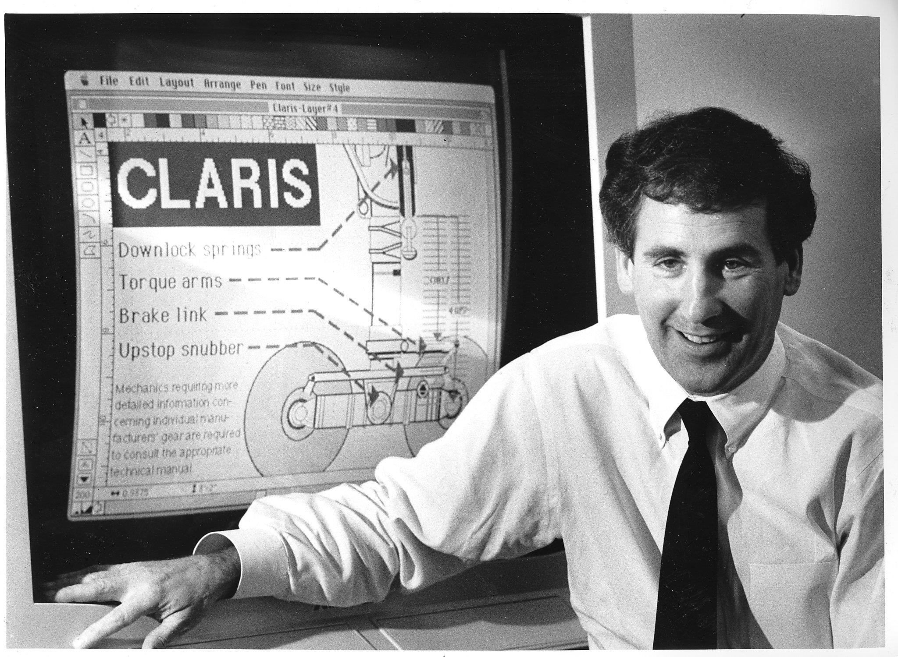

I’m trying to read more leadership books at the moment. I’m enjoying Trillion Dollar Coach – The Leadership Playbook of Silicon Valley’s Bill Campbell written by Eric Schmidt, Jonathan Rosenberg, and Alan Eagle.

I’m sure I will have more reflections in time, but this section struck a chord.

### Innovation is where crazy people have stature

Schmidt, Eric; Rosenberg, Jonathan; Eagle, Alan. Trillion Dollar Coach: The Leadership Handbook of Silicon Valley's Bill Campbell (p. 69). John Murray Press. Kindle Edition.

"The purpose of a company is to take the vision you have of the product and bring it to life," Bill once said at a conference. "Then, you put all the other components around it—finance, sales, marketing—to get the product out the door and ensure its success." This approach was not common in Silicon Valley, or most other places, when Bill arrived in the 1980s. Back then, while a company might be started by a technologist, it wasn’t long before a business executive with experience in sales, marketing, finance, or operations would be brought in to run things. These executives often didn’t prioritize the needs of engineers or focus on the product first.

Though Bill was a business executive, he believed that nothing was more important than empowering engineers. His consistent message was clear: product teams are the heart of the company, the ones who create new features and products. Their ultimate goal is to achieve great product-market fit. If you have the right product for the right market at the right time, you must push full steam ahead.

Eddy Cue, an Apple executive who helped create the App Store, recalls that when he first presented the concept to the Apple board, Bill immediately saw its larger potential. While others were focused on nuts-and-bolts questions, Bill was asking how they could leverage the opportunity. "Bill's questions were always about maximizing the potential," Eddy says. Bill often emphasized this: if you have the right product for the right market at the right time, speed is crucial. There will be minor issues that need fixing along the way, but speed is essential.

In Bill’s view, finance, sales, and marketing shouldn't dictate what product teams do. Instead, these departments should provide intelligence about customer problems and market opportunities—they describe the ‘market’ part of product-market fit. From there, their role is to support the product teams by clearing obstacles, not by telling them what to build. As Bill often said, "Why is marketing losing its clout? Because it forgot its first name: product."

Bill loved to tell a story from his time at Intuit, when they began venturing into banking products. They hired product managers with banking experience, and during one meeting, a manager presented his engineers with a list of features to build. Bill stopped him and said, "If you ever tell an engineer at Intuit which features to build, I’m going to throw you out on the street. Your job is to explain the consumer's problem and provide context. Let the engineers figure out the features—they’ll come up with a better solution than you could ever prescribe."

However, this doesn't mean engineers should be left to run wild, doing whatever they want. Product teams must partner with other departments from the start, forming cross-functional groups that push forward with new ideas and solutions. Bill, after all, was the marketing guy who walked down the street to work directly with engineers on a problem. He believed that engineers and other creators need influence and some degree of freedom.

Ron Sugar, an Apple board member and former CEO of Northrop Grumman, noted, "Bill helped me understand that in a company like Apple, the independence of creative thinking, and the willingness to be nonconformist, is a strength. You have to embrace that nonconformist streak."

[Trillion Dollar Coach on Goodreads](https://www.goodreads.com/book/show/42118073-trillion-dollar-coach)

