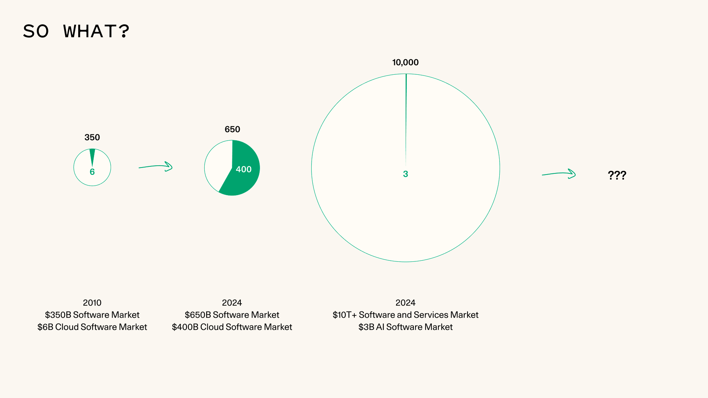

I found the _Generative AI's Act o1_ [blog](https://www.sequoiacap.com/article/generative-ais-act-o1/) by Sonya Huang and Pat Grady at Sequoia to be incredibly insightful. I've been reflecting on what's next for Nearmap, and this blog helped me build a broader understanding of the trends shaping the SaaS/AI space.

### A Few Highlights:

“…[foundation] models have largely failed to make it into the application layer as breakout products, with the notable exception of ChatGPT. The real world is messy. Great researchers don’t have the desire to understand the nitty gritty end-to-end workflows of every possible function in every possible vertical. It is both appealing and economically rational for them to stop at the API, and let the developer universe worry about the messiness of the real world. Good news for the application layer.”

“An emerging pattern is to deploy as a copilot first (human-in-the-loop) and use those reps to earn the opportunity to deploy as an autopilot (no human in the loop). GitHub Copilot is a good example of this.”

- Cloud companies targeted the software profit pool, while AI companies target the services profit pool.
- Cloud companies sold software ($/seat), whereas AI companies sell work ($/outcome).
- Cloud companies favored a bottoms-up approach with frictionless distribution, whereas AI companies increasingly adopt top-down, high-touch, high-trust delivery models.

“But for any given domain, it is still hard to gather real-world data and encode domain and application-specific cognitive architectures. This is again where last-mile app providers may have the upper hand in solving the diverse set of problems in the messy real world.”

### Questions:

1. Where are the 'service profit pools' where we can sell AI-generated outcomes?
2. How can we collect more 'real-world data' and create 'domain and application-specific cognitive architectures?
3. How do we create 'top-down, high-touch, high-trust' distribution/GTM strategies?

