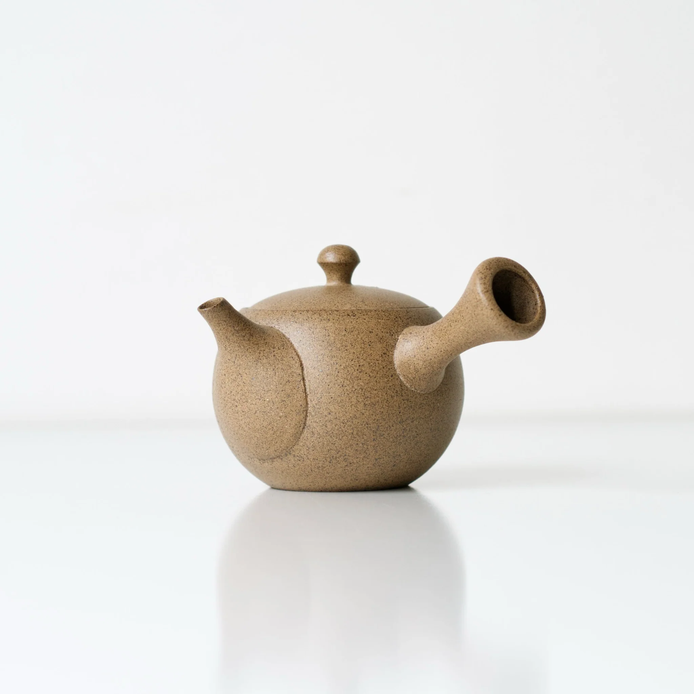

“Be formless, shapeless, like water. You put water into a cup, it becomes the cup. You put water into a bottle, it becomes the bottle. You put it in a teapot, it becomes the teapot. Now water can flow or it can crash. Be water, my friend.”

