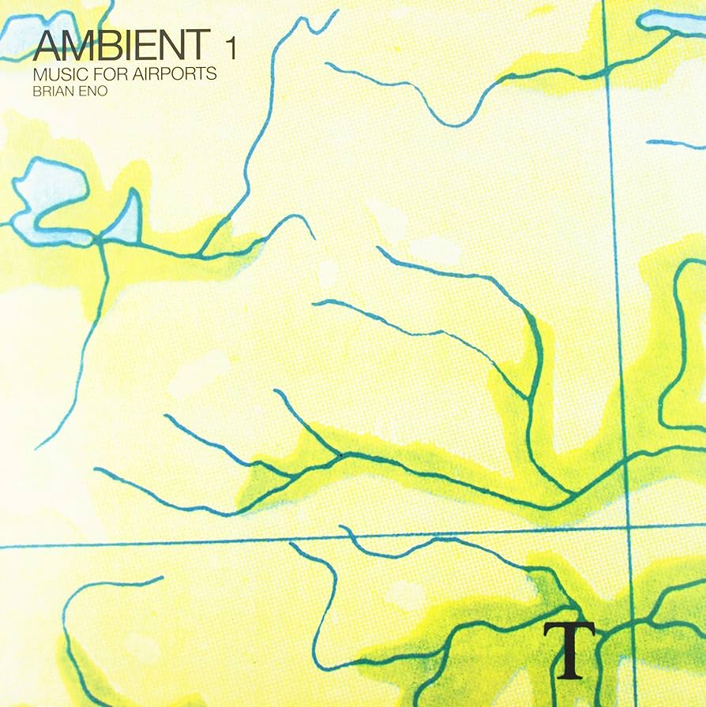

I watched Gary Hustwit's new [film](https://www.hustwit.com/eno) about Brian Eno this week. One of the most fascinating parts was the story behind the creation of _Ambient 1: Music for Airports_.

Eno recounts an experience at the newly built Cologne Bonn Airport, where he noticed a stark contrast between the beautiful minimalism of the architecture and the unpleasant music playing over the speakers. This inspired him to create a soundtrack that would not only complement the aesthetic but also help passengers feel calmer about the experience of flying. Rather than simply distracting travellers from the subconscious fear of death that Eno believes many harbour while flying, the music aimed to bring a sense of peace and acceptance.

What struck me most was the depth of his creative thinking—sidestepping the clichés of ambient music to create something profoundly moving.

You can listen to the album [here](hhttps://open.spotify.com/album/063f8Ej8rLVTz9KkjQKEMa?si=bVtvjwpUShOOqIqdAMLfXg).

