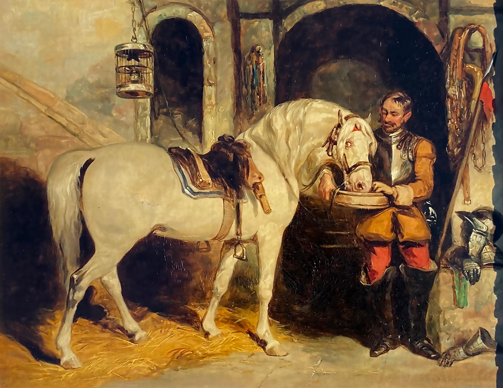

“The fastest way to starve a horse is to assign two people to feed it.”

I came across this quote shortly after [learning](https://medium.com/@dsmithdesignleadership/squad-vs-directly-responsible-individual-a-comparative-study-of-team-models-in-product-development-096a1f7cb563) about Apple’s Directly Responsible Individual (DRI) framework. The concept makes a lot of sense: certain tasks need a single, clear owner. Without that, momentum stalls, standards slip—or the horse goes hungry.

It’s a great reminder that progress relies on clarity. Someone has to hold the bucket.

