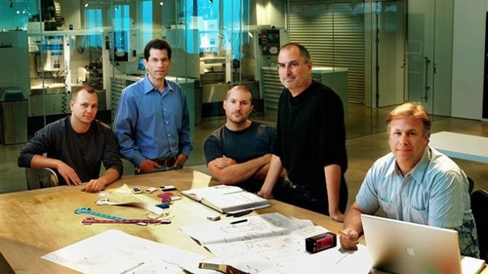

Great reminded that even the best ideas need help...

### From Tony Fadell:

"So, what was the most painful lesson I learned building the iPod. Honestly? The most painful lesson was learning that vision isn’t enough… you must fight for it every single day.

When I joined Apple, the iPod was just an idea. People inside the company weren’t 100% sold. “Why should Apple build a music player? We’re a computer company.” I went for it every step of the way- for the team, the resources, the roadmap, even for the name! Once we shipped the uphill battle didn’t stop. We had to push for Windows compatibility. Push for iTunes. Push to make it a part of a broader ecosystem.

My takeaway: no matter how right the vision is, it means nothing unless you’re willing to defend it. Repeatedly. Relentlessly. The iPod only existed because a small group of us refused to give up. We were told NO a lot. That was irritating and exhausting. But it taught me a lot!"

[LinkedIn Post](https://www.linkedin.com/posts/tonyfadell_ipod-activity-7388649542180732928-z5LN?utm_source=share&utm_medium=member_ios&rcm=ACoAAA90tW8BuPmiGMr96fp9SdSDcIvw2Xekea8)

